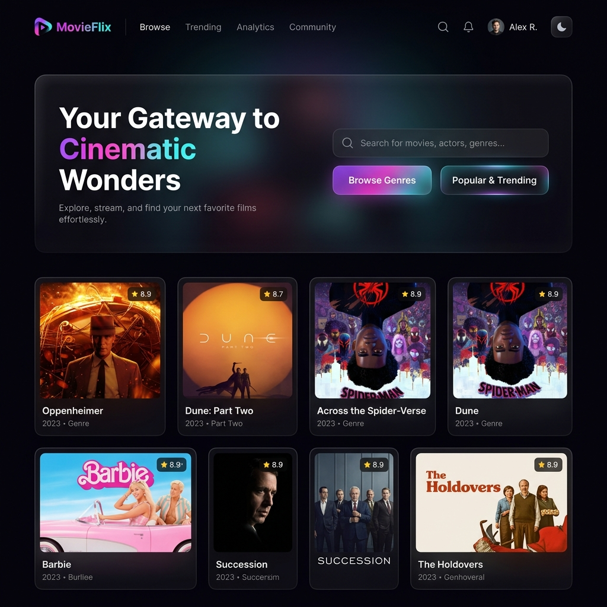
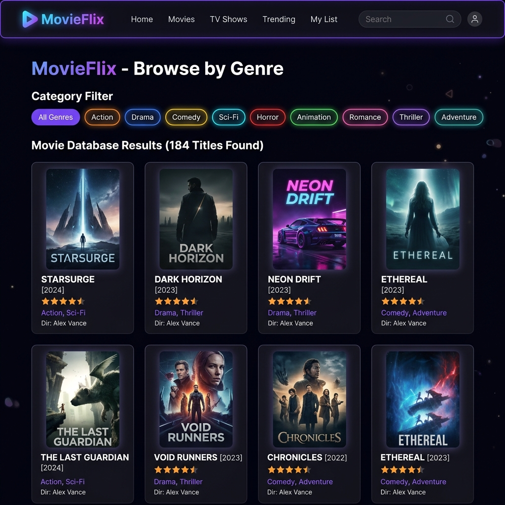
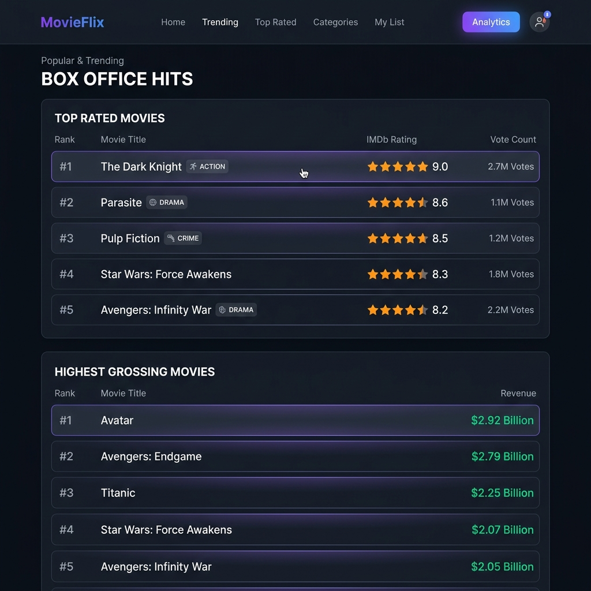
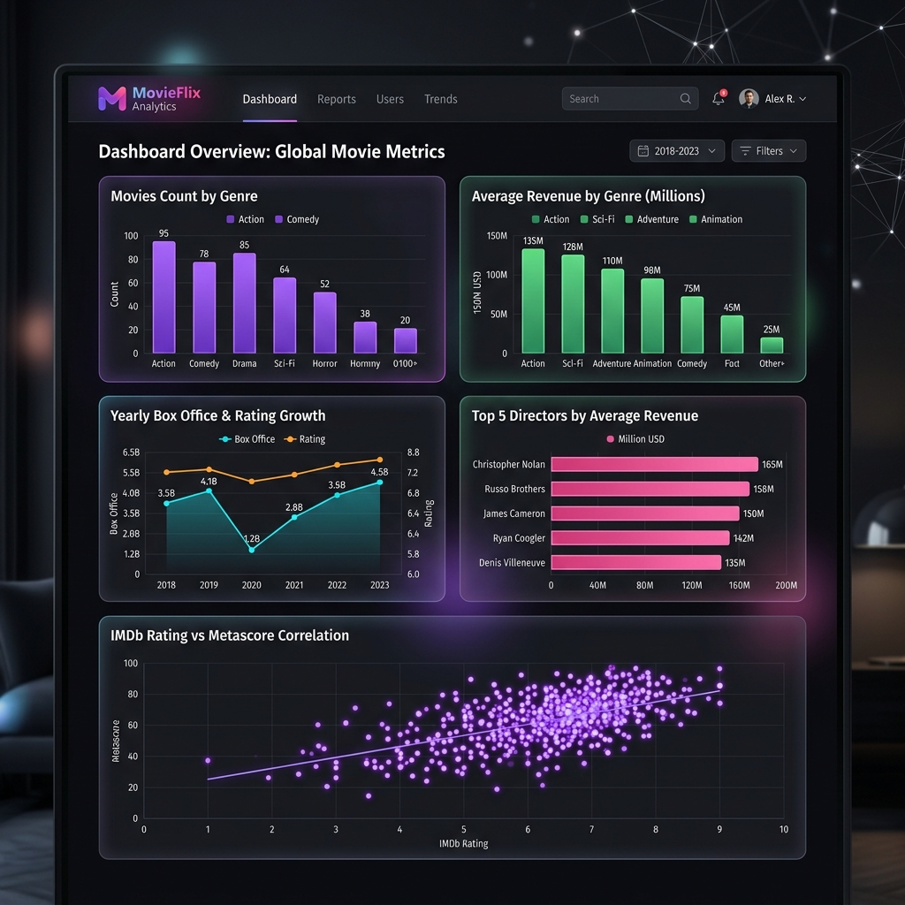
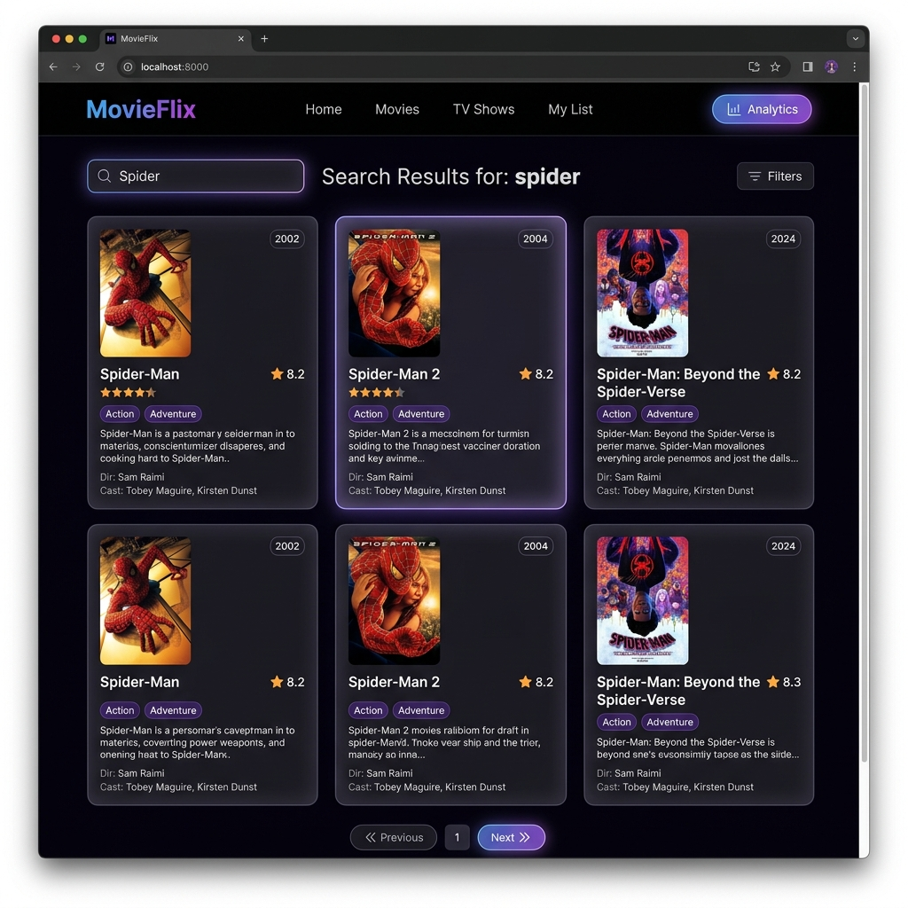

# 🎬 MovieFlix

> **Live Demo:** [https://movie-flix-app-dataset.vercel.app](https://movie-flix-app-dataset.vercel.app)

MovieFlix is a premium cinematic movie discovery web application built with **FastAPI** and **Jinja2**. Explore movies, search by title/actor/director, filter by genres, check box office analytics, and submit anonymous reviews.

---

## 📸 App Screenshots

### 🏠 Home Page


### 🎭 Browse by Genre


### 🔥 Popular & Trending


### 📊 Interactive Analytics Dashboard


### 🔍 Search Results


---

## ✨ Features

- **🎬 Movie Discovery** — Browse 1000+ movies with poster images, ratings, and details.
- **🔍 Smart Search** — Search by title, director, actor, or description.
- **🎭 Genre Filters** — Filter the Kaggle database by one or multiple genres.
- **🔥 Popular & Trending** — Top-rated and highest-grossing movies at a glance.
- **📊 Analytics Dashboard** — Interactive charts: genre distribution, revenue trends, rating correlations, top directors.
- **⭐ Anonymous Reviews** — Submit your own star ratings and reviews without registration.
- **🌙 Dark Mode Default** — Sleek dark-first design with light/dark toggle.

## 🛠️ Technologies Used

- **FastAPI** — High-performance Python web framework.
- **Jinja2** — Templating engine for HTML rendering.
- **Pandas** — For handling and processing movie dataset.
- **TailwindCSS** — Utility-first CSS via CDN for responsive design.
- **Chart.js** — Interactive data visualizations on the analytics page.
- **Font Awesome** — Icons throughout the UI.
- **Vercel** — Cloud deployment platform.

## 🚀 Installation

### Prerequisites

- Python 3.x
- `pip` (Python package manager)

### Steps

1. Clone the repository:

   ```bash
   git clone https://github.com/satyamjaysawal/MovieFlix-App-Dataset.git
   cd MovieFlix-App-Dataset
   ```

2. Create and activate a virtual environment:

   **Windows:**
   ```bash
   python -m venv venv
   venv\Scripts\activate
   ```

   **macOS/Linux:**
   ```bash
   python3 -m venv venv
   source venv/bin/activate
   ```

3. Install the required dependencies:

   ```bash
   pip install -r requirements.txt
   ```

4. Run the application:

   ```bash
   python app.py
   ```

   The app will be available at `http://127.0.0.1:8000/`

## 📁 File Structure

```
MovieFlix-App-Dataset/
├── app.py                    # Main FastAPI application
├── MovieDataSet.csv          # Movie dataset (1000+ movies)
├── reviews.json              # Anonymous reviews storage
├── requirements.txt          # Python dependencies
├── vercel.json               # Vercel deployment config
├── templates/
│   ├── home.html             # Homepage with hero & movie grid
│   ├── genre.html            # Genre filter & movie database
│   ├── popular_trending.html # Box office charts
│   ├── analytics.html        # Interactive analytics dashboard
│   └── search.html           # Search results page
└── static/
    ├── bg.jpg                # Cinematic background image
    ├── screenshots/          # App screenshots
    └── *.jpg                 # Movie poster images
```

## 🤝 Contributing

Feel free to fork this project and submit pull requests. If you encounter any bugs or have ideas for new features, please open an issue.
